# Lab 4 — Secure Employee & Guest Wireless Network with VLANs, Router-on-a-Stick, DHCP & ACLs

## Project Overview

This project demonstrates the design, configuration, security, and troubleshooting of a small enterprise wireless network using **Cisco Packet Tracer**.

The network separates company devices, employee wireless devices, internal servers, and guest wireless users into different VLANs.

The primary goal was to provide:

* Secure employee Wi-Fi
* Separate guest Wi-Fi
* VLAN-based network segmentation
* Dynamic IP addressing using DHCP
* Inter-VLAN routing using Router-on-a-Stick
* Wireless authentication using WPA2-PSK
* Guest isolation using an extended Access Control List (ACL)
* Access to internal servers for employees
* Restricted internal access for guest users
* Network troubleshooting practice

The final design allows employee devices to access internal company resources while preventing guest wireless users from accessing the internal server network.

---

# Skills Demonstrated

This lab demonstrates practical experience with:

* Cisco Packet Tracer
* Cisco IOS CLI
* VLAN configuration
* Access ports
* Trunk ports
* IEEE 802.1Q
* Router-on-a-Stick
* Router subinterfaces
* Inter-VLAN routing
* IPv4 addressing
* Subnetting
* DHCP
* DHCP excluded addresses
* Wireless Access Points
* SSIDs
* WPA2-PSK security
* Wireless client configuration
* Static IP addressing
* Dynamic IP addressing
* Extended Access Control Lists
* ACL placement
* Wildcard masks
* Guest network isolation
* Switch troubleshooting
* Router troubleshooting
* Wireless troubleshooting
* Structured network troubleshooting

---

# Network Topology

The network consists of:

* 1 Cisco Router
* 1 Cisco 2960 Switch
* 1 Wired Company PC
* 1 Internal Server
* 2 Wireless Access Points
* 2 Wireless Laptops

One access point provides employee Wi-Fi while the other provides guest Wi-Fi.

```text
                         Router0
                            |
                          TRUNK
                            |
                         Switch1
         ___________________|____________________
        |             |            |            |
       PC0          Server0    Employee AP    Guest AP
                                   )))            )))
                                Laptop0        Laptop1
```

## Network Topology Screenshot

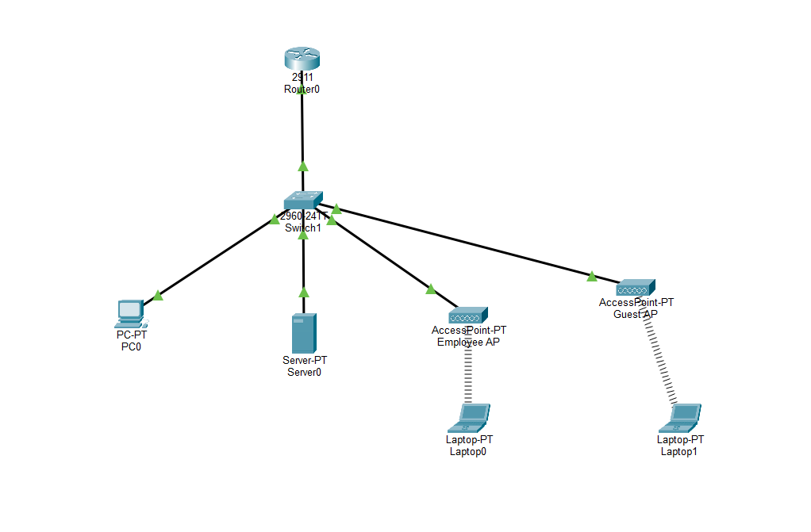

---

# Network Segmentation Design

Four VLANs were created.

| VLAN | Name          | Purpose                   | Network         | Gateway      |
| ---- | ------------- | ------------------------- | --------------- | ------------ |
| 10   | COMPANY       | Wired Company Devices     | 192.168.10.0/24 | 192.168.10.1 |
| 20   | EMPLOYEE_WIFI | Employee Wireless Devices | 192.168.20.0/24 | 192.168.20.1 |
| 30   | SERVER        | Internal Servers          | 192.168.30.0/24 | 192.168.30.1 |
| 40   | GUEST_WIFI    | Guest Wireless Devices    | 192.168.40.0/24 | 192.168.40.1 |

Logical design:

```text
VLAN 10
COMPANY
192.168.10.0/24
      |
      |
      +------------------+
                         |
VLAN 20                  |
EMPLOYEE_WIFI            |
192.168.20.0/24          |
      |                  |
      +------------ Router0
                         |
VLAN 30                  |
SERVER                   |
192.168.30.0/24          |
      |                  |
      +------------------+
                         |
VLAN 40                  |
GUEST_WIFI               |
192.168.40.0/24          |
```

---

# IP Addressing Plan

## VLAN 10 — Company Network

```text
Network Address:   192.168.10.0
Subnet Mask:       255.255.255.0
CIDR:              /24
Default Gateway:   192.168.10.1
DHCP Start:        192.168.10.20
Broadcast:         192.168.10.255
```

---

## VLAN 20 — Employee Wi-Fi

```text
Network Address:   192.168.20.0
Subnet Mask:       255.255.255.0
CIDR:              /24
Default Gateway:   192.168.20.1
DHCP Start:        192.168.20.20
Broadcast:         192.168.20.255
```

---

## VLAN 30 — Server Network

```text
Network Address:   192.168.30.0
Subnet Mask:       255.255.255.0
CIDR:              /24
Default Gateway:   192.168.30.1
Server0:           192.168.30.10
Broadcast:         192.168.30.255
```

---

## VLAN 40 — Guest Wi-Fi

```text
Network Address:   192.168.40.0
Subnet Mask:       255.255.255.0
CIDR:              /24
Default Gateway:   192.168.40.1
DHCP Start:        192.168.40.20
Broadcast:         192.168.40.255
```

---

# VLAN Configuration

The following VLANs were created on Switch1.

```text
enable
configure terminal

vlan 10
name COMPANY
exit

vlan 20
name EMPLOYEE_WIFI
exit

vlan 30
name SERVER
exit

vlan 40
name GUEST_WIFI
exit

end
```

The configuration was verified using:

```text
show vlan brief
```

The expected VLANs are:

```text
10   COMPANY
20   EMPLOYEE_WIFI
30   SERVER
40   GUEST_WIFI
```

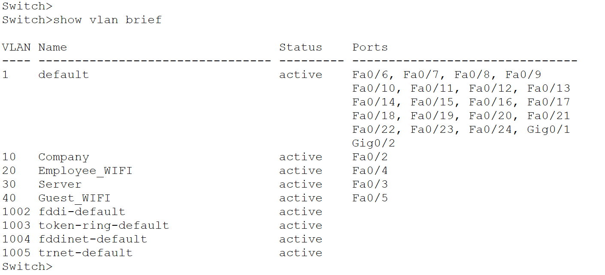

---

# Switch Access Port Configuration

Each end device was assigned to the appropriate VLAN using an access port.

Example configuration:

## Company PC

```text
configure terminal

interface FastEthernet0/1
switchport mode access
switchport access vlan 10
exit
```

---

## Employee Access Point

```text
interface FastEthernet0/10
switchport mode access
switchport access vlan 20
exit
```

---

## Server

```text
interface FastEthernet0/3
switchport mode access
switchport access vlan 30
exit
```

---

## Guest Access Point

```text
interface FastEthernet0/11
switchport mode access
switchport access vlan 40
exit
```

The actual interface numbers may differ depending on the physical Packet Tracer topology.

---

# Switch Trunk Configuration

The switch port connected to Router0 was configured as a trunk.

The trunk carries traffic for all four VLANs.

```text
interface FastEthernet0/24
switchport mode trunk
switchport trunk allowed vlan 10,20,30,40
exit

end
```

The trunk was verified with:

```text
show interfaces trunk
```

The expected allowed VLAN list is:

```text
10,20,30,40
```

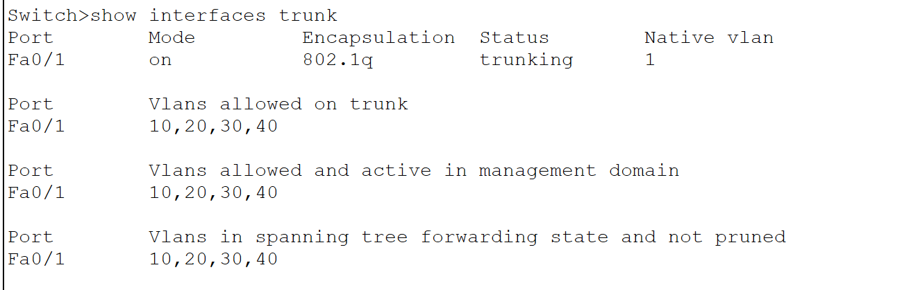

---

# Why a Trunk Is Required

An access port carries traffic for only one VLAN.

Example:

```text
Fa0/1 → VLAN 10 only
```

A trunk port can carry traffic for multiple VLANs.

Example:

```text
Fa0/24
 |
 + VLAN 10
 + VLAN 20
 + VLAN 30
 + VLAN 40
```

This allows one physical connection between the switch and router to transport traffic from all four VLANs.

---

# Router-on-a-Stick Configuration

The network uses **Router-on-a-Stick** for Inter-VLAN routing.

Only one physical router interface connects to the switch.

Logical subinterfaces were created for each VLAN.

```text
Router0 G0/0
      |
      +---- G0/0.10
      |
      +---- G0/0.20
      |
      +---- G0/0.30
      |
      +---- G0/0.40
```

---

# Enable Physical Router Interface

```text
enable
configure terminal

interface GigabitEthernet0/0
no shutdown
exit
```

No IPv4 address was assigned directly to G0/0.

Instead, IP addresses were assigned to the subinterfaces.

---

# VLAN 10 Router Subinterface

```text
interface GigabitEthernet0/0.10
encapsulation dot1Q 10
ip address 192.168.10.1 255.255.255.0
exit
```

This becomes the default gateway for VLAN 10.

---

# VLAN 20 Router Subinterface

```text
interface GigabitEthernet0/0.20
encapsulation dot1Q 20
ip address 192.168.20.1 255.255.255.0
exit
```

This becomes the default gateway for Employee Wi-Fi.

---

# VLAN 30 Router Subinterface

```text
interface GigabitEthernet0/0.30
encapsulation dot1Q 30
ip address 192.168.30.1 255.255.255.0
exit
```

This becomes the default gateway for the Server VLAN.

---

# VLAN 40 Router Subinterface

```text
interface GigabitEthernet0/0.40
encapsulation dot1Q 40
ip address 192.168.40.1 255.255.255.0
exit

end
```

This becomes the default gateway for Guest Wi-Fi.

---

# Router Subinterface Verification

The configuration was verified using:

```text
show ip interface brief
```

Expected interfaces:

```text
GigabitEthernet0/0       unassigned       up   up

GigabitEthernet0/0.10    192.168.10.1     up   up

GigabitEthernet0/0.20    192.168.20.1     up   up

GigabitEthernet0/0.30    192.168.30.1     up   up

GigabitEthernet0/0.40    192.168.40.1     up   up
```

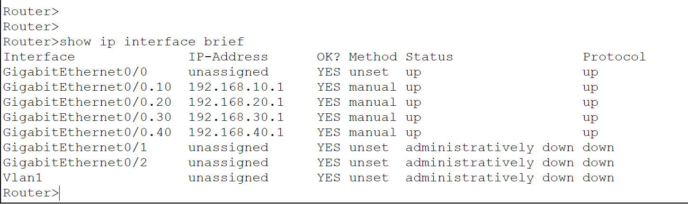

---

# Server Static IP Configuration

Server0 was manually assigned a static IPv4 address.

```text
IP Address:       192.168.30.10
Subnet Mask:      255.255.255.0
Default Gateway:  192.168.30.1
```

The server was intentionally kept outside the DHCP client pools.

This ensures that the internal server maintains a predictable IP address.

---

# DHCP Configuration

Router0 provides DHCP services to:

* VLAN 10
* VLAN 20
* VLAN 40

Server0 uses a static address and therefore does not require DHCP.

---

# DHCP Excluded Addresses

Addresses `.1` through `.19` were excluded.

```text
configure terminal

ip dhcp excluded-address 192.168.10.1 192.168.10.19

ip dhcp excluded-address 192.168.20.1 192.168.20.19

ip dhcp excluded-address 192.168.40.1 192.168.40.19
```

This prevents DHCP from assigning infrastructure addresses.

Example:

```text
192.168.20.1     Router Gateway
192.168.20.2-.19 Reserved
192.168.20.20+   DHCP Clients
```

---

# VLAN 10 DHCP Pool

```text
ip dhcp pool COMPANY

network 192.168.10.0 255.255.255.0

default-router 192.168.10.1

dns-server 8.8.8.8

exit
```

---

# Employee Wi-Fi DHCP Pool

```text
ip dhcp pool EMPLOYEE_WIFI

network 192.168.20.0 255.255.255.0

default-router 192.168.20.1

dns-server 8.8.8.8

exit
```

---

# Guest Wi-Fi DHCP Pool

```text
ip dhcp pool GUEST_WIFI

network 192.168.40.0 255.255.255.0

default-router 192.168.40.1

dns-server 8.8.8.8

exit

end
```

---

# DHCP Pool Verification

DHCP pools were checked using:

```text
show ip dhcp pool
```

The router contained:

```text
COMPANY
EMPLOYEE_WIFI
GUEST_WIFI
```

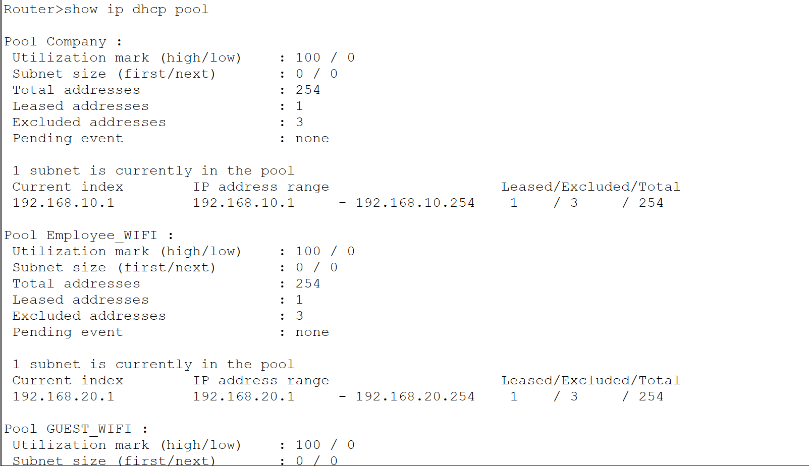

---

# DHCP Binding Verification

Active DHCP leases were checked using:

```text
show ip dhcp binding
```

The router issued addresses from different networks.

Example:

```text
PC0             → 192.168.10.x

Employee Laptop → 192.168.20.x

Guest Laptop    → 192.168.40.x
```

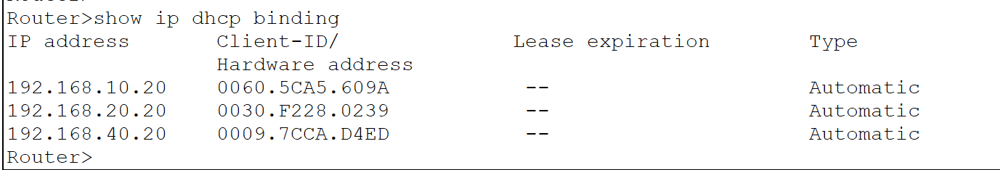

---

# Employee Wireless Network

The first access point was configured for company employees.

```text
SSID:     COMPANY-WIFI
Security: WPA2-PSK
```

The employee AP connects to a switch access port assigned to:

```text
VLAN 20
```

Therefore wireless clients connecting through this AP become members of the Employee Wi-Fi VLAN.

Logical flow:

```text
Laptop0
   )))
COMPANY-WIFI
   )))
Employee AP
   |
Switch Access Port
   |
VLAN 20
   |
192.168.20.0/24
```

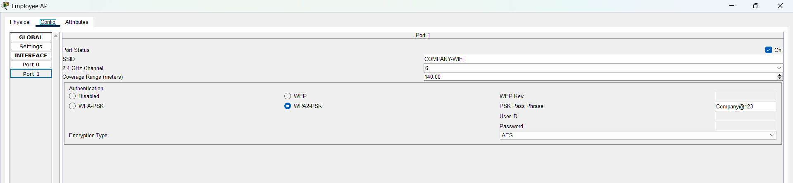

---

# Guest Wireless Network

The second access point was configured for guest users.

```text
SSID:     GUEST-WIFI
Security: WPA2-PSK
```

The Guest AP switch port was assigned to:

```text
VLAN 40
```

Logical flow:

```text
Laptop1
   )))
GUEST-WIFI
   )))
Guest AP
   |
Switch Access Port
   |
VLAN 40
   |
192.168.40.0/24
```

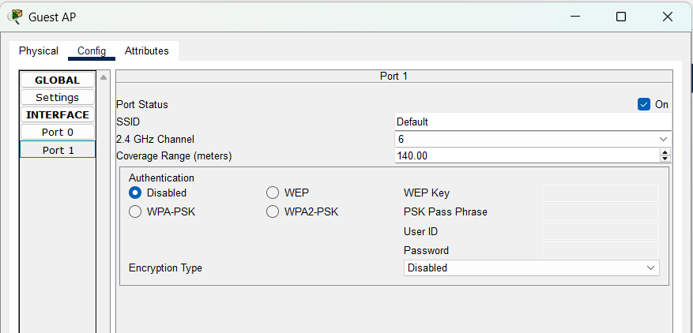

---

# Wireless Adapter Configuration

The Packet Tracer laptops required a wireless adapter before connecting to Wi-Fi.

The **WPC300N** wireless module was installed in each Laptop-PT device.

Process:

```text
1. Open Laptop Physical tab

2. Power OFF the laptop

3. Remove the existing network module if required

4. Install WPC300N

5. Power ON the laptop

6. Open Desktop → PC Wireless

7. Select the correct SSID

8. Enter the wireless security key
```

---

# Employee Laptop DHCP Verification

Laptop0 connected to:

```text
COMPANY-WIFI
```

and received an address from:

```text
192.168.20.0/24
```

Example:

```text
IP Address:       192.168.20.20
Subnet Mask:      255.255.255.0
Default Gateway:  192.168.20.1
```

The configuration was checked using:

```text
ipconfig
```

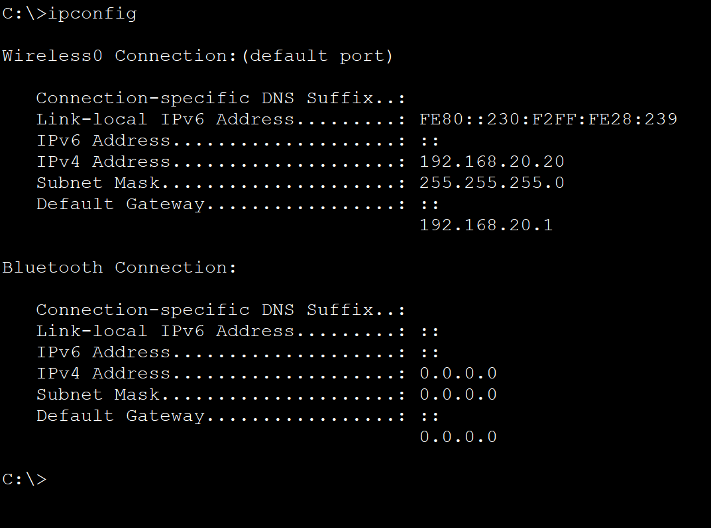

---

# Guest Laptop DHCP Verification

Laptop1 connected to:

```text
GUEST-WIFI
```

and received an address from:

```text
192.168.40.0/24
```

Example:

```text
IP Address:       192.168.40.20
Subnet Mask:      255.255.255.0
Default Gateway:  192.168.40.1
```

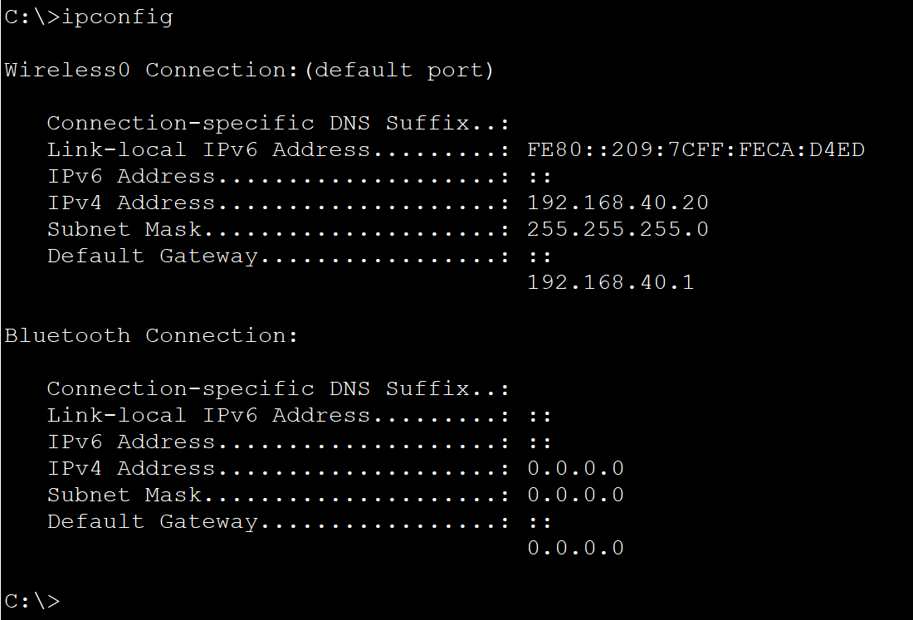

---

# Employee Access to Internal Server

Employees should be allowed to communicate with internal company resources.

From Laptop0:

```text
ping 192.168.30.10
```

The ping succeeded.

This demonstrated:

```text
Employee Laptop
192.168.20.x
      |
      v
VLAN 20
      |
      v
Router0
      |
      v
VLAN 30
      |
      v
Server0
192.168.30.10
```

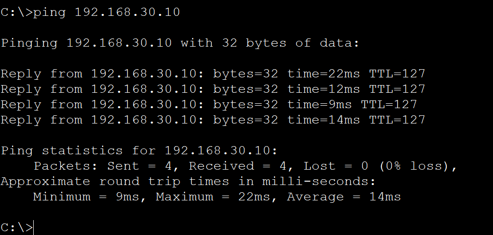

---

# Guest Network Security Requirement

Guest Wi-Fi users should not be able to reach internal company servers.

Before applying security restrictions, Router0 would normally route traffic between VLAN 40 and VLAN 30.

Therefore an extended ACL was created.

The security policy was:

```text
Employee → Server     ALLOW

Guest → Server        DENY

Guest → Own Gateway   ALLOW
```

---

# Extended Guest ACL

The ACL was created using:

```text
enable
configure terminal

ip access-list extended GUEST_BLOCK

deny ip 192.168.40.0 0.0.0.255 192.168.30.0 0.0.0.255

permit ip any any

exit
```

The important rule is:

```text
deny ip 192.168.40.0 0.0.0.255 192.168.30.0 0.0.0.255
```

It means:

```text
SOURCE
192.168.40.0/24
Guest Network

           ↓

DESTINATION
192.168.30.0/24
Server Network

           ↓

DENY
```

---

# Why the Entire Server Network Was Blocked

The rule blocks:

```text
192.168.30.0/24
```

rather than only:

```text
192.168.30.10
```

because VLAN 30 represents the entire server network.

A future organization could have:

```text
192.168.30.10 → File Server

192.168.30.11 → Database Server

192.168.30.12 → Backup Server

192.168.30.13 → Application Server
```

Guest users should not have access to any internal server.

---

# ACL Wildcard Mask

The ACL uses:

```text
0.0.0.255
```

as the wildcard mask for a `/24` network.

Example:

```text
192.168.40.0 0.0.0.255
```

represents:

```text
192.168.40.0/24
```

---

# Applying the ACL

Creating an ACL alone does not enforce it.

The ACL must be applied to an interface.

The guest ACL was applied inbound on:

```text
GigabitEthernet0/0.40
```

Configuration:

```text
configure terminal

interface GigabitEthernet0/0.40

ip access-group GUEST_BLOCK in

exit

end
```

The ACL was placed inbound because guest traffic enters Router0 through the VLAN 40 subinterface.

---

# ACL Verification

The ACL was verified using:

```text
show access-lists
```

Expected configuration:

```text
Extended IP access list GUEST_BLOCK

deny ip 192.168.40.0 0.0.0.255 192.168.30.0 0.0.0.255

permit ip any any
```

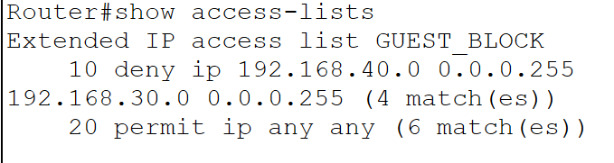

---

# ACL Interface Verification

The router configuration was checked using:

```text
show running-config
```

The VLAN 40 interface contained:

```text
interface GigabitEthernet0/0.40

 ip address 192.168.40.1 255.255.255.0

 ip access-group GUEST_BLOCK in
```

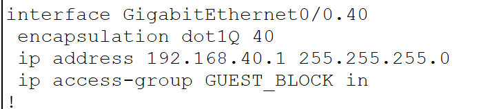

---

# Guest Server Access Test

From Laptop1:

```text
ping 192.168.30.10
```

The ping failed.

This failure was expected.

It proved that guest users were prevented from reaching the internal server network.

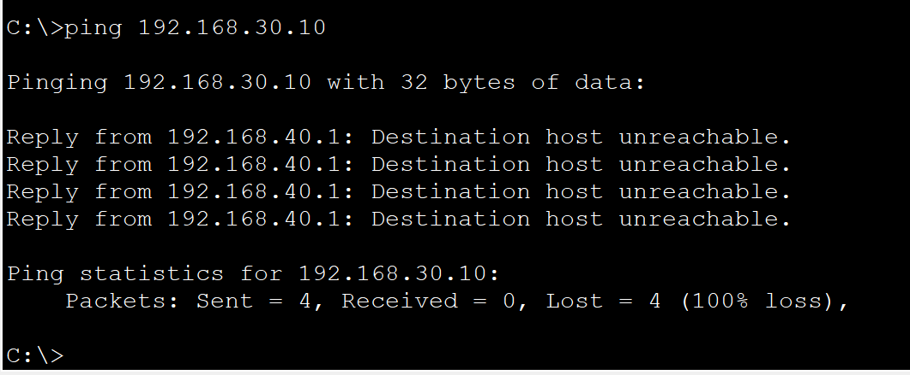

Final security result:

```text
Employee Laptop → Server0   ✓ ALLOWED

Guest Laptop → Server0      ✗ BLOCKED
```

---

# Guest Gateway Connectivity Test

Guest users still need normal network connectivity.

From Laptop1:

```text
ping 192.168.40.1
```

The ping succeeded.

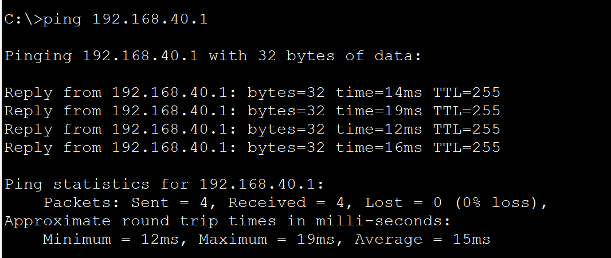

This proves that the ACL does not completely disconnect guest users.

Instead, it specifically restricts access to internal company resources.

---

# Troubleshooting Scenario 1 — Wrong AP VLAN

The Employee Access Point was intentionally moved from VLAN 20 to VLAN 40.

Incorrect configuration:

```text
interface FastEthernet0/10

switchport access vlan 40
```

Laptop0 was still connected to:

```text
COMPANY-WIFI
```

but after requesting DHCP again, it received:

```text
192.168.40.x
```

instead of:

```text
192.168.20.x
```

This indicated that the Employee AP traffic was entering the Guest VLAN.


---

# Diagnosing the Wrong VLAN

The client configuration was checked with:

```text
ipconfig
```

Expected:

```text
192.168.20.x
```

Received:

```text
192.168.40.x
```

The switch was then checked using:

```text
show vlan brief
```

The AP port was discovered under VLAN 40 instead of VLAN 20.

Troubleshooting logic:

```text
Connected to COMPANY-WIFI
        |
Received Guest IP
192.168.40.x
        |
        v
Check AP Switch Port
        |
        v
Wrong VLAN Assignment
```

---

# Fixing the Employee AP VLAN

The correct VLAN was restored:

```text
configure terminal

interface FastEthernet0/10

switchport mode access

switchport access vlan 20

end
```

Laptop0 then requested DHCP again and received:

```text
192.168.20.x
```

---

# Troubleshooting Scenario 2 — Missing VLAN From Trunk

The router trunk was intentionally configured without VLAN 20.

Incorrect configuration:

```text
interface FastEthernet0/24

switchport trunk allowed vlan 10,30,40
```

VLAN 20 was missing.

As a result, Employee Wi-Fi traffic could not reach Router0.

Laptop0 failed to reach:

```text
192.168.20.1
```

---

# Diagnosing the Trunk

The switch trunk configuration was checked using:

```text
show interfaces trunk
```

The output showed:

```text
Vlans allowed on trunk:

10,30,40
```

VLAN 20 was missing.


This demonstrated an important troubleshooting clue:

```text
One VLAN does not work
        |
Other VLANs still work
        |
        v
Check Trunk
        |
        v
Check Allowed VLAN List
```

---

# Fixing the Trunk

The correct allowed VLAN list was restored:

```text
configure terminal

interface FastEthernet0/24

switchport trunk allowed vlan 10,20,30,40

end
```

Verification:

```text
show interfaces trunk
```

Expected:

```text
10,20,30,40
```

---

# Troubleshooting Scenario 3 — Incorrect Wi-Fi Password

Laptop0 was intentionally configured using an incorrect WPA2 password.

The laptop could see:

```text
COMPANY-WIFI
```

but could not successfully authenticate.

The following items were checked:

```text
SSID
Wireless Security Type
WPA2 Password
Wireless Adapter
```

The correct security configuration was restored.

The client successfully connected afterward.

---

# Wireless Troubleshooting Method

If a user can see the wireless network but cannot connect:

```text
Can the client see the SSID?
        |
        v
Is the SSID correct?
        |
        v
Is security type correct?
        |
        v
Is the password correct?
        |
        v
Is the client connected?
        |
        v
Then check DHCP/IP configuration
```

This helps separate a wireless authentication issue from an IP addressing issue.

---

# Troubleshooting Scenario 4 — ACL Not Applied

The Guest ACL was intentionally removed from the VLAN 40 interface.

Command:

```text
configure terminal

interface GigabitEthernet0/0.40

no ip access-group GUEST_BLOCK in

end
```

The ACL still existed.

```text
show access-lists
```

continued to display:

```text
GUEST_BLOCK
```

However, Guest users could reach:

```text
192.168.30.10
```

because the ACL was no longer attached to the interface.

---

# ACL Troubleshooting Lesson

An ACL requires two steps:

```text
1. Create the ACL

2. Apply the ACL
```

For example:

```text
ip access-list extended GUEST_BLOCK
```

creates the ACL.

But:

```text
ip access-group GUEST_BLOCK in
```

actually activates it on an interface.

An ACL that is not applied to an interface does not filter traffic.

---

# Fixing the ACL

The ACL was reapplied:

```text
configure terminal

interface GigabitEthernet0/0.40

ip access-group GUEST_BLOCK in

end
```

The Guest Laptop was again unable to reach:

```text
192.168.30.10
```

while the Employee Laptop remained able to access the server.

---

# Important Switch Commands

## Display VLANs

```text
show vlan brief
```

Used to verify:

* VLAN creation
* VLAN names
* Access port assignments

---

## Display Trunk Information

```text
show interfaces trunk
```

Used to verify:

* Trunk status
* Native VLAN
* Allowed VLANs
* Active VLANs

---

## Display Switch Port Status

```text
show interfaces status
```

Used to verify whether ports are:

```text
connected
notconnect
disabled
```

---

# Important Router Commands

## Display Router Interfaces

```text
show ip interface brief
```

Used to verify:

* Physical router interface
* Subinterfaces
* IP addresses
* Interface status

---

## Display DHCP Pools

```text
show ip dhcp pool
```

Used to verify DHCP scope configuration.

---

## Display DHCP Leases

```text
show ip dhcp binding
```

Used to identify DHCP addresses currently assigned to clients.

---

## Display ACLs

```text
show access-lists
```

Used to verify:

* ACL rules
* Rule order
* Permit statements
* Deny statements
* Match counters

---

## Display Router Configuration

```text
show running-config
```

Used to verify:

* Subinterfaces
* IP addresses
* DHCP configuration
* ACL configuration
* ACL placement

---

# Important Client Commands

## View Client IP Configuration

```text
ipconfig
```

Used to verify:

* IPv4 address
* Subnet mask
* Default gateway

---

## Test Local Gateway

Employee Laptop:

```text
ping 192.168.20.1
```

Guest Laptop:

```text
ping 192.168.40.1
```

---

## Test Internal Server

```text
ping 192.168.30.10
```

Expected:

```text
Employee Laptop → Success

Guest Laptop → Failure
```

---

# Final Security Policy

The finished network follows this policy:

| Source         | Destination    | Result  |
| -------------- | -------------- | ------- |
| Company PC     | Router         | Allowed |
| Company PC     | Server         | Allowed |
| Employee Wi-Fi | Gateway        | Allowed |
| Employee Wi-Fi | Server         | Allowed |
| Guest Wi-Fi    | Gateway        | Allowed |
| Guest Wi-Fi    | Server Network | Blocked |

---

# Final Network Design

```text
                           Router0
                              |
                            G0/0
                              |
                            TRUNK
                              |
                           Switch1
          ____________________|____________________
         |              |              |           |
      VLAN 10         VLAN 20        VLAN 30     VLAN 40
      COMPANY      EMPLOYEE_WIFI      SERVER    GUEST_WIFI
         |              |              |           |
        PC0        Employee AP       Server0     Guest AP
                        )))                          )))
                     Laptop0                      Laptop1

192.168.10.x       192.168.20.x   192.168.30.10 192.168.40.x
```

---

# Final Router Subinterfaces

```text
G0/0.10
VLAN 10
192.168.10.1/24

G0/0.20
VLAN 20
192.168.20.1/24

G0/0.30
VLAN 30
192.168.30.1/24

G0/0.40
VLAN 40
192.168.40.1/24
```

---

# Final DHCP Design

```text
VLAN 10
192.168.10.20+

VLAN 20
192.168.20.20+

VLAN 40
192.168.40.20+
```

Server0 remains statically configured as:

```text
192.168.30.10
```

---

# Final Wireless Design

## Employee Wi-Fi

```text
SSID: COMPANY-WIFI
Security: WPA2-PSK
VLAN: 20
Network: 192.168.20.0/24
Gateway: 192.168.20.1
```

Employee users can access internal company resources.

---

## Guest Wi-Fi

```text
SSID: GUEST-WIFI
Security: WPA2-PSK
VLAN: 40
Network: 192.168.40.0/24
Gateway: 192.168.40.1
```

Guest users cannot access the internal Server VLAN.

---

# Final ACL Configuration

```text
ip access-list extended GUEST_BLOCK

 deny ip 192.168.40.0 0.0.0.255 192.168.30.0 0.0.0.255

 permit ip any any
```

Applied to:

```text
interface GigabitEthernet0/0.40

 ip access-group GUEST_BLOCK in
```

---

# Troubleshooting Scenarios Completed

The following faults were intentionally introduced and successfully diagnosed:

1. Employee Access Point assigned to the wrong VLAN
2. VLAN 20 removed from the router trunk
3. Incorrect Wi-Fi password
4. Guest ACL removed from the VLAN 40 interface

These exercises demonstrated troubleshooting across:

* Layer 1 connectivity
* Layer 2 switching
* VLAN membership
* Trunk configuration
* Layer 3 addressing
* DHCP
* Wireless authentication
* Access Control Lists

---

# Troubleshooting Methodology

A structured troubleshooting process was used throughout the lab:

```text
1. Check physical connectivity
        |
        v
2. Check wireless connection
        |
        v
3. Verify SSID/security
        |
        v
4. Check client IP configuration
        |
        v
5. Verify VLAN assignment
        |
        v
6. Verify trunk configuration
        |
        v
7. Ping default gateway
        |
        v
8. Verify router subinterfaces
        |
        v
9. Check DHCP
        |
        v
10. Check ACL/security rules
```

---

# Common Symptoms and Possible Causes

| Symptom                                                  | Possible Cause                         |
| -------------------------------------------------------- | -------------------------------------- |
| Connected to Employee Wi-Fi but receives `192.168.40.x`  | Wrong AP VLAN                          |
| Employee Wi-Fi cannot reach gateway but other VLANs work | VLAN missing from trunk                |
| Wi-Fi SSID visible but connection fails                  | Wrong password/security                |
| Client receives no DHCP address                          | VLAN, trunk, DHCP, or wireless problem |
| Guest can reach Server0                                  | ACL missing or incorrectly applied     |
| ACL exists but traffic is not blocked                    | ACL not applied to interface           |
| One VLAN cannot route                                    | Router subinterface/trunk issue        |
| Laptop has no PC Wireless option                         | Wireless adapter missing               |
| Router subinterface down                                 | Physical/trunk/router problem          |

---

# Key Concepts Learned

## VLAN Segmentation

VLANs allow multiple logical networks to share the same physical switch while remaining separated.

```text
VLAN 10 → Company

VLAN 20 → Employee Wireless

VLAN 30 → Servers

VLAN 40 → Guests
```

---

## Router-on-a-Stick

Router-on-a-Stick allows a single router interface to route traffic between multiple VLANs using 802.1Q subinterfaces.

---

## Wireless Security

WPA2-PSK was used to prevent unauthorized wireless access.

Separate SSIDs were created for employees and guests.

---

## DHCP

DHCP automatically provides:

```text
IP Address
Subnet Mask
Default Gateway
DNS Server
```

to network clients.

---

## ACL Security

Extended ACLs can filter traffic based on:

```text
Source
Destination
Protocol
```

This allows the router to enforce policies such as:

```text
Guest → Server = DENY
```

while allowing other traffic.

---

# Final Results

The completed network successfully achieved:

```text
VLAN Segmentation            ✓
Router-on-a-Stick            ✓
802.1Q Trunking              ✓
Inter-VLAN Routing           ✓
Employee Wi-Fi               ✓
Guest Wi-Fi                  ✓
WPA2 Wireless Security       ✓
DHCP                         ✓
Static Server Address        ✓
Guest Isolation              ✓
Extended ACL                 ✓
Employee Server Access       ✓
Guest Server Blocking        ✓
VLAN Troubleshooting         ✓
Trunk Troubleshooting        ✓
Wireless Troubleshooting     ✓
ACL Troubleshooting          ✓
```

---

# Project Outcome

This project successfully created a segmented and secured enterprise-style wireless network.

Company, employee wireless, server, and guest devices were separated using VLANs.

Router-on-a-Stick provided Inter-VLAN routing using one physical router interface and four 802.1Q subinterfaces.

Router0 provided DHCP services to the company, employee, and guest networks.

The internal server was assigned a static IP address:

```text
192.168.30.10
```

The employee wireless network was allowed to communicate with the server network.

The guest network was prevented from accessing internal servers using an extended ACL.

Final security behavior:

```text
Employee Laptop → Server0   ✓ ALLOWED

Guest Laptop → Server0      ✗ BLOCKED

Guest Laptop → Gateway      ✓ ALLOWED
```

The lab also included multiple troubleshooting scenarios involving VLANs, trunking, wireless authentication, DHCP addressing, and ACL configuration.

---

# Final Verification

```text
Company VLAN              ✓
Employee Wi-Fi VLAN       ✓
Server VLAN               ✓
Guest Wi-Fi VLAN          ✓
Router Subinterfaces      ✓
Trunk                     ✓
DHCP                      ✓
Wireless Authentication   ✓
Employee Server Access    ✓
Guest Isolation           ✓
ACL Enforcement           ✓
Troubleshooting           ✓
```

## Lab 4 Successfully Completed
